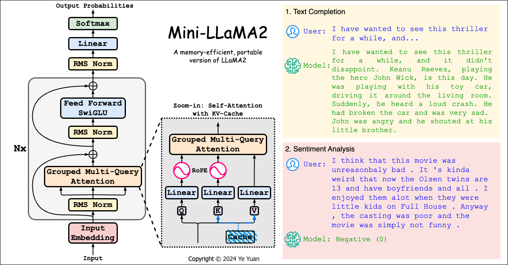

# Mini-LLaMA2: A Compact Implementation of LLaMA2



This project is a compact version of Llama2, a leading open-source language model. It was originally developed as an exercise for Carnegie Mellon University's [CS11-711 Advanced NLP](http://phontron.com/class/anlp2024/) course. The project is now open-source and welcomes contributions from the community.

## Project Overview

Mini-LLaMA2 is a streamlined version of the Llama2 language model. The model is capable of performing a variety of tasks, including text completion, zero-shot prompt-based sentiment analysis, and task-specific finetuning.

The text completion functionality allows the model to generate coherent and grammatically correct English continuations given a sentence. This feature showcases the model's ability to understand and generate language in a contextually appropriate manner.

The zero-shot, prompt-based sentiment analysis functionality enables the model to perform sentiment analysis on two datasets (SST-5 and CFIMDB) without any task-specific finetuning. This demonstrates the model's ability to generalize its understanding of language to new tasks.

The task-specific finetuning functionality allows the model to be fine-tuned for a specific task, resulting in significantly improved classification results. This feature highlights the model's adaptability and its ability to learn from specific task-related data.

The model utilizes pretrained weights from `stories42M.pt`, an 8-layer, 42M parameter language model pretrained on the [TinyStories](https://arxiv.org/abs/2305.07759) dataset. This allows the model to leverage a vast amount of pre-existing language understanding, enhancing its performance on the aforementioned tasks.

Key components of the model are housed in `run_llama.py`, `llama.py`, `classifier.py`, and `optimizer.py`. These components include the main model architecture, the classification head, and the optimization algorithm, all of which are crucial to the model's functionality.

The project includes three main functionalities:

1) Text completion: Given a sentence, the model generates a coherent, grammatical English continuation.
2) Zero-shot, prompt-based sentiment analysis: The model performs sentiment analysis on two datasets (SST-5 and CFIMDB) without any task-specific finetuning.
3) Task-specific finetuning: The model is finetuned for a specific task, providing much stronger classification results.

## Getting Started

To set up the environment and install dependencies, follow the instructions in `setup.sh`.

The main code can be found in `run_llama.py`. Other important components are in `llama.py`, `classifier.py`, and `optimizer.py`.

## Usage

You can run the model with the following command:

```shell
python3 run_llama.py --option [generate/prompt/finetune] --epochs 5 --lr 2e-5 --train data/sst-train.txt --dev data/sst-dev.txt --test data/sst-test.txt
```

## Contributing

We welcome contributions to this project. If you have a feature request, bug report, or proposal for code improvements, please open an issue or submit a pull request.

## Acknowledgement

This code is based on llama2.c by Andrej Karpathy. Parts of the code are also from the [`transformers`](https://github.com/huggingface/transformers) library ([Apache License 2.0](./LICENSE)).